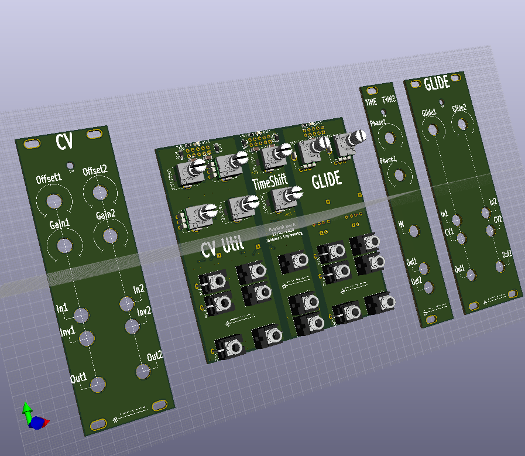
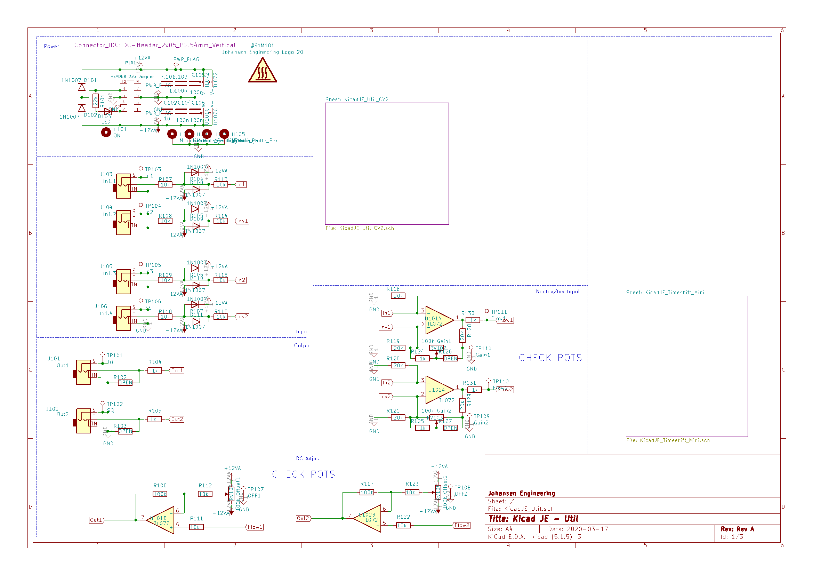
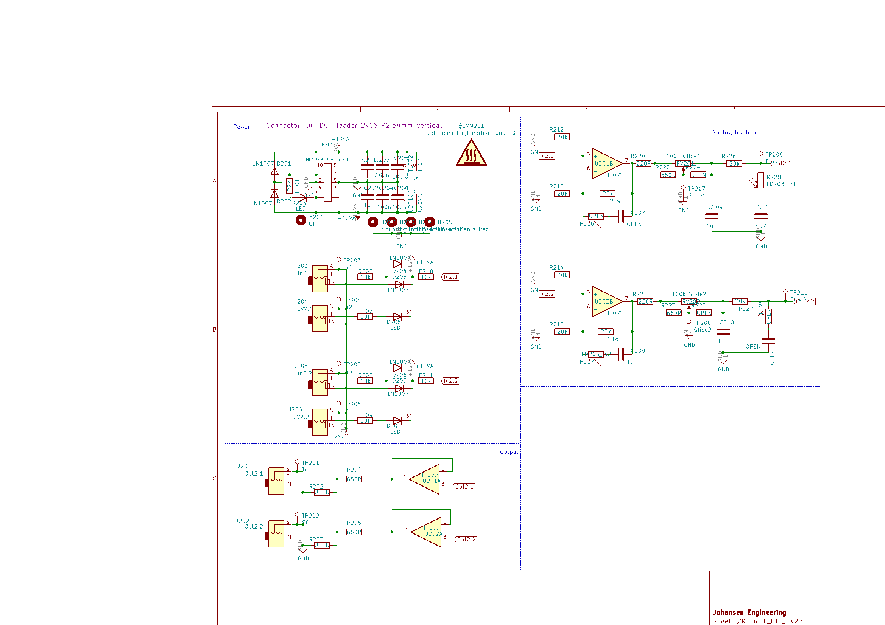
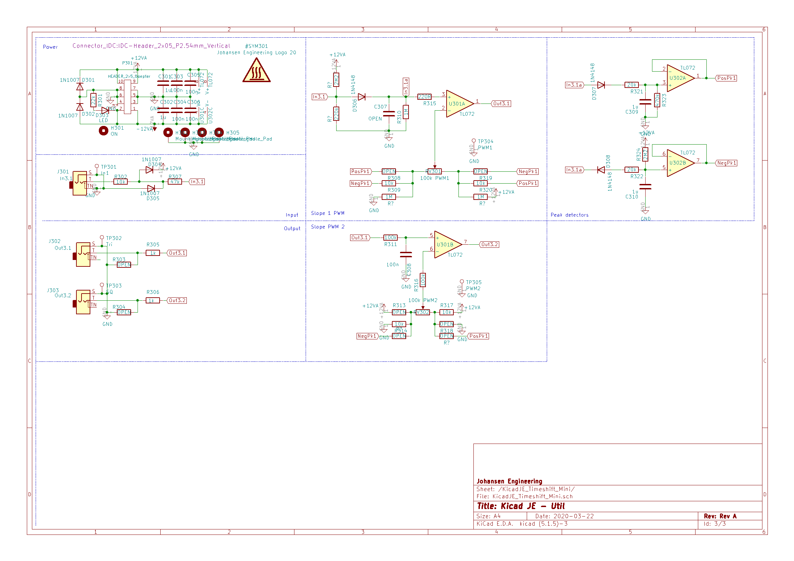

# KicadJE_Util
CV utility module

# Purpose

## CV Util 1
Input +/- 10V DC

Output +/- 10V DC

Adjustment:

Inv/Noninv (input)

Offset

Gain 

## CV Util 2 - Glide
0-10V input

0-10V Output

## Gate Util 1 - Timing
0-10V input

Time shift of the start and end phase

# Status - TimeShift mounted
## Initial 
| Stage  | Detail | Status |
| ------------- | ------------- | ------------- |
| create material  | sch | ok |
| | pcb | ok |
| | gerber | ok |
| production  |   | ok |
|  | produced | ok |
|  | delivered | ok |
## Preliminary validation
| Test  | Detail | Status |
| ------------- | ------------- | ------------- |
| Initial Inspection | | ok |
| Initial Technical Test | Util |  |
| Initial Technical Test | Glide |  |
| Initial Technical Test | TimeShift | Ok - but problem in pos/neg detection |
| Initial Product Test | Util |  |
| Initial Product Test | Glide |  |
| Initial Product Test | TimeShift |  |

## Secondary validation
| Test  | Detail | Status |
| ------------- | ------------- |------------- |
| Product Test |  | |
| Product Test |  | |
| Quality |  | |
| Quality | | |
| Long Term Product Test |  |  |
| Power Draw |  | 

## Errata
### Errata - 

## Issues and Notes
### 

# Pictures

# Schematic
## DC util

## Glide util

## TimeShift util

# Analysis
## Timeshift

## Prototype
